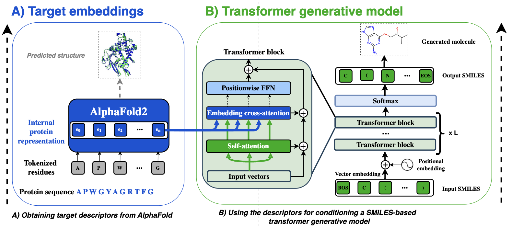
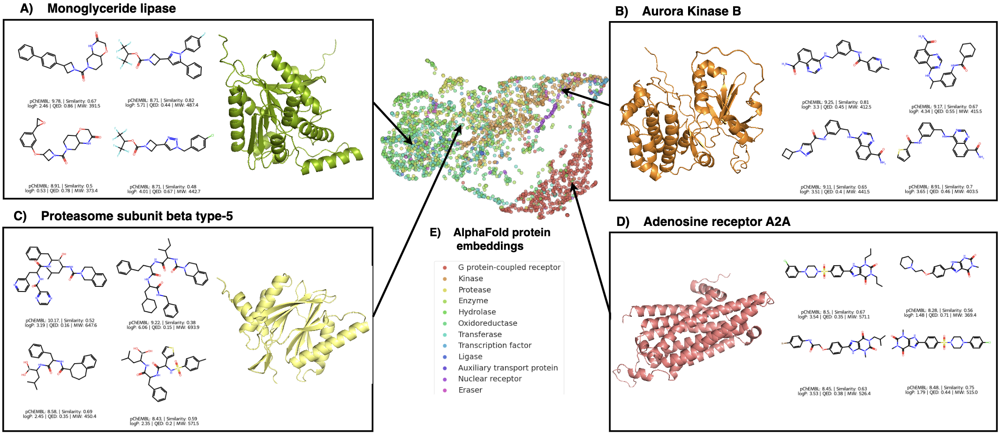
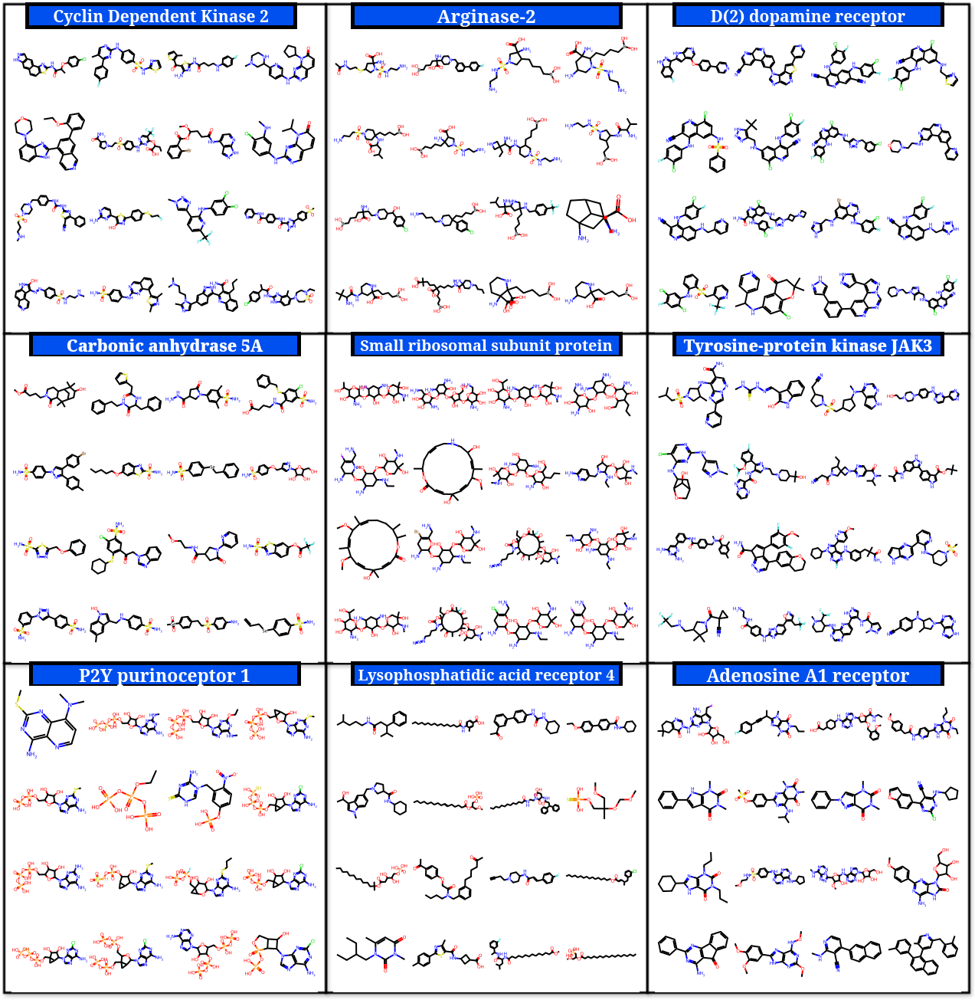

# PCMol 
 [](https://doi.org/10.5281/zenodo.10512870) [](https://opensource.org/licenses/MIT)

A multi-target model for de novo molecule generation. By using the internal protein representations of the AlphaFold<sup>[1]</sup> model, a single SMILES-based transformer can generate relevant molecules for thousands of protein targets (embeddings are available for 4,331 proteins). 

The model was trained using bioactivity data from the Papyrus<sup>[2]</sup> dataset (661,613 unique protein-ligand pairs in total, 6,249,253 after augmentation).

**AlphaFold Embedding dataset:** [Zenodo](https://zenodo.org/records/10671261) 

---



---


*Molecules generated by the PCMol generative model when using AlphaFold latent embeddings of particular proteins **(A-D)** as input.*


<!-- ## Requirements

- **Python** 3.8+
- **rdkit** 2021.03.5.0+
- **Torch** 1.7 - 2.1 -->

---

# Installation


### 1. Setup script (recommended)
The setup script will install the required dependencies and download the pretrained model.

```bash
git clone https://github.com/CDDLeiden/pcmol.git && cd pcmol
chmod +x setup.sh
bash setup.sh
```

### 2. Conda (alternative)
The conda route requires the user to download the pretrained model manually (link below).

```bash
# Setting up a fresh conda environment
git clone https://github.com/CDDLeiden/pcmol.git && cd pcmol
conda env create -f environment.yml && conda activate pcmol
python -m pip install -e .
```
<!-- 
### 3. Docker 

*Note: The docker image is currently not available.*

The docker image contains all the prerequisites and the pretrained model.
```bash
# Pull the docker image
docker pull andriusbern/pcmol:latest
``` -->

### Pretrained model

**When not using the setup script, the pretrained model can be downloaded from [here](https://zenodo.org/records/10512870)[ (mirror)](https://surfdrive.surf.nl/files/index.php/s/T0wUBOmAEYYxxOo). It should then be placed in the `.../pcmol/data/models` folder.*

---

# Generating molecules for a particular target
<!-- 
### 1. Docker
```bash
# Run the model on a single target using UniProt ID (generates 10 SMILES strings)
docker run -it andriusbern/pcmol:latest python -m pcmol.generate --target P21819
``` -->

### 1. Using a script (conda route) 
```bash
# Run the model on a single target using Accession ID (generates 10 SMILES strings)
conda activate pcmol
python pcmol/generate.py --target P29275

# If GPU is not available
python pcmol/generate.py --target P29275 --device cpu
```


If available, the appropriate AlphaFold2 embeddings to be used as input to the model will be downloaded automatically. The generated molecules are saved in the `data/results` folder.

### 2. Calling the generator directly

To generate molecules for a particular target, the `Runner` class can be used directly. The `generate_smiles` method returns a list of SMILES strings for a target protein specified by its Accession ID.

```python
from pcmol import Runner

model = Runner(model="XL")
SMILES = model.targetted_generation(protein_id="P29275", batch_size=1, repeat=10)
```

### Examples of molecules generated for different targets:

A single pretrained PCMol model can generate molecules for thousands of different targets.



More examples can be found in [notebooks/generate.ipynb](https://github.com/CDDLeiden/PCMol/blob/main/notebooks/generate.ipynb)

## List of supported protein targets

The model currently depends on the availability of AlphaFold2 embeddings for the target protein. The list of supported targets can be found in the [data/targets.txt](data/targets.txt) file.

<!-- ## Training

To retrain the model you first need to download the dataset from [here]().

```bash
## Train the model
python pcmol/train.py --model default
``` -->

---

## Paper & Authors

The paper is available on [ACS Journal of Chemical Information and Modeling](https://pubs.acs.org/doi/10.1021/acs.jcim.4c00309).

### Citation (BibTeX)

```
@article{doi:10.1021/acs.jcim.4c00309,
author = {Bernatavicius, Andrius and Šícho, Martin and Janssen, Antonius P. A. and Hassen, Alan Kai and Preuss, Mike and van Westen, Gerard J. P.},
title = {AlphaFold Meets De Novo Drug Design: Leveraging Structural Protein Information in Multitarget Molecular Generative Models},
journal = {Journal of Chemical Information and Modeling},
volume = {0},
number = {0},
pages = {null},
year = {0},
doi = {10.1021/acs.jcim.4c00309},
    note ={PMID: 39475544},
URL = {https://doi.org/10.1021/acs.jcim.4c00309},
eprint = {https://doi.org/10.1021/acs.jcim.4c00309}
}
```

---

## References

[1]: Jumper, J., Evans, R., Pritzel, A., Green, T., Figurnov, M., Ronneberger, O., ... & Hassabis, D. (2021). **Highly accurate protein structure prediction with AlphaFold.** Nature, 596(7873), 583-589.

[2]: Béquignon, O. J., Bongers, B. J., Jespers, W., IJzerman, A. P., van der Water, B., & van Westen, G. J. (2023). **Papyrus: a large-scale curated dataset aimed at bioactivity predictions.** Journal of cheminformatics, 15(1), 3.
